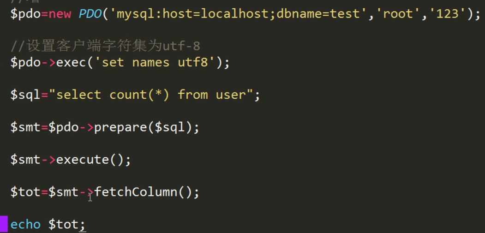
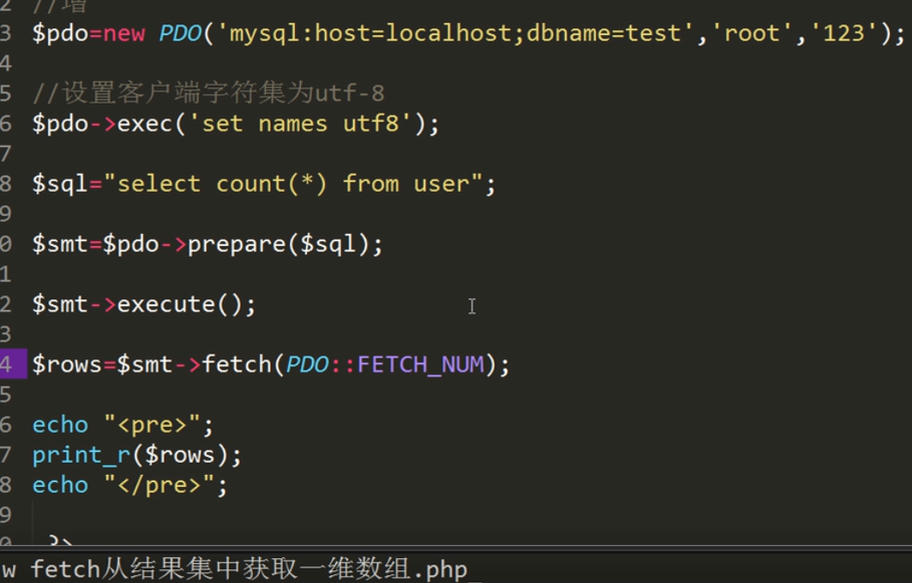

# MySQL和PDO学习笔记
router.php	路由调整简化


```
<?php
/**
 * SQL数据库（关系型）
 * 收费
 * DB2
 * Sqlserver
 * Oracle
 * 开源
 * MySQL
 * Sqlite
 * Postgresql
 *NOSQL非关系型
 * 1.MongoDB
 * 2.Redis
 * 3.Memcache
 *
 *MySQL数据库
 * 服务器：数据库、数据表
 * 数据表：表结构（字段）自定义 表数据 表索引
 * id name
 * 表引擎：myisam innodb
 *
 *mySql基本命令
 *mysql -uroot -p123登录mysql
 *show databases;   查看数据库
 *use test;         切换到test数据库
 * show tables;     查看所有表
 * desc user;       查看user表中字段
 *select * from user查看表中所有数据
 * exit             退出
 *
 * 数据库操作
 *create database xxx 创建数据库
 * drop database xxx 删除数据库
 *
 * 数据表操作
 * create table xxx(
        id int,
 *      username varchar(30),
 *      age int
 * ); 创建数据表
 * drop table xxx 删除数据表
 *
 * 表数据操作
 *
 * 查看数据表
 * select * from xxx
 * 修改数据
 * update XXX set age=30 where id=2
 * 插入数据
 * insert into xxx(id,name,pwd) values(1,'user1',20)
 * 删除数据
 * delete from XXX where id=1;
 *
 * 表字段类型
 * 数值
 * int（11）有符号
 * int（10）无符号
 * float
 * 字符串
 * char(30) 0-255字节
 * varchar(30) 0-255字节
 * text 65535字节
 * 日期字符串
 * 时间戳
 *
 *属性
 * unsigned 无标记
 * zerofill 0填充
 * auto_increment 自增，前提是必须是主键
 * null 空
 * not null 不为空
 * default 默认
 *
 *表索引
 * 主键索引
 * 唯一索引
 * 普通索引
 *
 * mysql结构化查询数据
 * DDL 数据定义语言create drop alter
 * DML 数据操作语言insert update delete
 * DQL 数据查询语言select
 * DCL 数据控制语言grant commit rollback
 *
 * 数据表操作DML
 *
 * sql条件
 * 数学运算符 +- / %
 * 逻辑运算符 && || and or between...and
 * 比较运算符<>=!=
 *
 * 增insert
 * insert into user(username,password) values('user1','123')
 * 删delete不改变自身自增顺序
 * delete from user where id=4
 * 重置自增顺序truncate user;(清空表数据)
 * 改update
 * update user set password='456' where id=2
 * 查select
 * select * from user
 * select username from user
 * select * from user where id=5
 *
 * 查询数据DQL--select
 *
 * 1.选择特定的字段
 * select id,name from user;
 *
 * 2.给字段取个别名-as
 * select id as xxx,name from
 *
 * 3.distinct关键字的使用 （去重、求唯一值）
 * select distinct age from user
 *
 * 4.使用where条件查询
 * select * from user where id = 3
 *
 * 5.查询空值null
 * select * from user where age is null
 * select * from user where age is not null
 *
 * 6.between...and
 * select * from user where id between 3 and 5;
 *
 * 7.in的使用方法 等同于or
 * select * from user where id in (3,5);
 *
 * 8.like 的使用方法
 * %匹配所有 _匹配一个字符
 * select * from user where name like "%mysql%" %在前name这一列的索引会失效
 *
 * 9.使用order by对查询结果排序
 * select * from user order by id asc; 默认升序,数字从小到大排列
 * select * from user order by id desc; 默认倒序，数字从大到小排列
 *
 * 10.regexp正则检索
 * select * from user where name regexp "^php$"
 *
 * 11.limit限定输出的字数
 * select * from  user limit 3;
 * select * from  user limit 3,5; 从3开始截取5条数据
 * 12.having 把分组聚合后的数据进行筛选 
 * select class_id,count(id) from user group by class_id having class_id<=2; 把班号小于等于2的打印输出
 *
 *
 * MySQL 常用函数
 * 连接函数concat()
 * select concat(username,'-',class_id) from user;
 * 随机数rand()
 * select * from user order by rand();
 * select * from user order by rand() limit 3;
 * 统计个数count（）
 * select count(*) from user;
 * 求和sum（）
 *  select sum(id) from user;
 * 平均值avg()
 * select avg(id) from user;
 * 最大值max（）
 * select max(id) from user;
 * 最小值min（）
 * select min(id) from user;
 *
 * group by 分组聚合
 * select class_id,count(id) from user group by class_id;
 * select concat(class_id,'-','class') class,count(*) tot from user group by class_id;
 *
 * 多表查询
 * 关系
 * 两个表是1对1关系  一个表一个主体  合并
 * 1对多的关系
 * 多对多的关系
 *
 * 创建class表
 * create table class (
 * id int unsigned not null auto_increment,
 * name varchar(30) not null,
 * primary key(id)
 * );
 * 创建user表
 * create table class (
 * id int unsigned not null auto_increment,
 * username varchar(50) not null,
 * password varchar(50) not null,
 * class_id int unsigned not null,
 * primary key(id)
 * );
 *
 * 普通多表查询
 * select * from user,class where user.class_id = class.id;
 * select user.username,class.name from user,class where user.class_id = class.id;
 *
 * 嵌套查询
 * select * from user where id in(select max(id) from user);
 *
 * 链接查询
 * left join左连接 获取左表所有记录，即使右表没有对应匹配的记录
 * select class.name,count(user.id) from class left join user on class.id = user.class_id group by class.id;
 * select class.name,if(count(user.id),count(user.id),'无') from class left join user on class.id = user.class_id group by class.id;
 *
 * right join 右连接 与 LEFT JOIN 相反，用于获取右表所有记录，即使左表没有对应匹配的记录
 * select class.name,count(user.id) from class right join user on class.id = user.class_id group by class.id;
 * select class.name,if(count(user.id),count(user.id),'无') tot from user right join class on class.id = user.class_id group by class.id;
 *
 * inner join 内连接,或等值连接 获取两个表中字段匹配关系的记录
 * 完全等于普通多表查询，必须是符合条件的多个数据表的数据才会显示
 * select class.name,count(user.id) from class inner join user on class.id = user.class_id group by class.id;
 *
 *
 * 拓展
 * select(select count(*) from score where score>=60) yes,(select count(*) from score where score<60) no;
 * select sum(if(score>=60,1,0))ok,sum(if(score<60,1,0)) nook from score;
 */

```
smt获取总行数







```
<?php
//链接数据库
$pdo = new PDO('mysql:host=localhost;dbname=test','root','123');
//设置字符集utf8
$pdo -> exec("set names utf8");
//查询
$sql = "select * from user";
//查表
$smt = $pdo->query($sql);

//返回关联数组
$rows = $smt->fetchAll(PDO::FETCH_ASSOC);
//返回索引数组
//$rows = $smt->fetchAll(PDO::FETCH_NUM);
//返回混合数组
//$rows = $smt->fetchAll(PDO::FETCH_BOTH);
//返回对象
//$rows = $smt->fetchAll(PDO::FETCH_OBJ);

//添加数据
$sql = "insert into user(username,password) values ('user9','123')";
$pdo -> exec($sql);
//删除数据
$sql = "delete from user where id=16";
$sql = "delete from user where id>=10 and id <= 15";
//更改数据
$sql = "update user set password='456' where id=9";
//查
$sql = "select * from user";
$pdo -> exec($sql);

//预处理器
/*
PDO类
query()
exec()
prepare()
lastInsertId()
setAttribute()
getAttribute()

pdostatement类
fetchAll()
fetchColumn()
execute()
rowCount()
bindValue()
bindParam()

PDO 事务机制
beginTransaction() 开启任务
commit() 成功提交本次任务
rollBack() 失败撤销回滚本次任务

PDOException类 错误异常处理类
getMessage()
getFile()
getLine()

 *
 * */
$smt = $pdo -> prepare($sql);
//预处理执行，返回true false
$smt -> execute();
//查询总行数多少条数据
$rows = $smt -> fetchAll(PDO::FETCH_ASSOC);
//处理多少行
$smt -> rowCount();
//设置pdo默认模式
$pdo -> setAttribute(PDO::ATTR_DEFAULT_FETCH_MODE,PDO::FETCH_ASSOC);

echo "<pre>";
print_r($rows);
echo "</pre>";

//事务处理
//设置pdo错误异常模式
$pdo -> setAttribute(PDO::ATTR_ERRMODE,PDO :: ERRMODE_EXCEPTION);
//开启事务
$pdo ->beginTransaction();
//抛出异常
try{
    //执行PDO
    $sql = 'delete from user where id=16';
    $smt = $pdo -> prepare($sql);
    //预处理执行，返回true false
    $smt -> execute();
    //中间可能会多次执行PDO
    //成功提交
    $pdo ->commit();
} catch (PDOException $exception){
    echo $exception->getFile();
    echo $exception->getLine();
    echo $exception->getMessage();
    echo $exception->getCode();
    //失败撤回
    $pdo ->rollBack();
}
//失败撤回
//$pdo ->rollBack();
//成功提交
//$pdo ->commit();
?>

```