# 这是一篇个人PHP自学笔记
```
PHPStrom破解：
https://blog.csdn.net/voke_/article/details/78794567
ThinkPHP5.0学习指南
https://www.kancloud.cn/manual/thinkphp5/118006
```
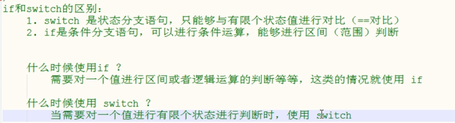
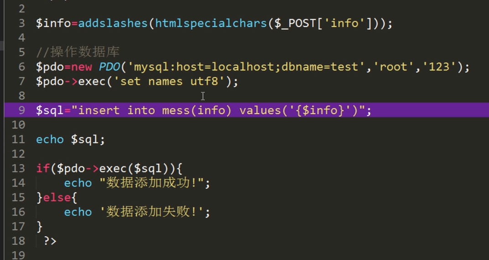
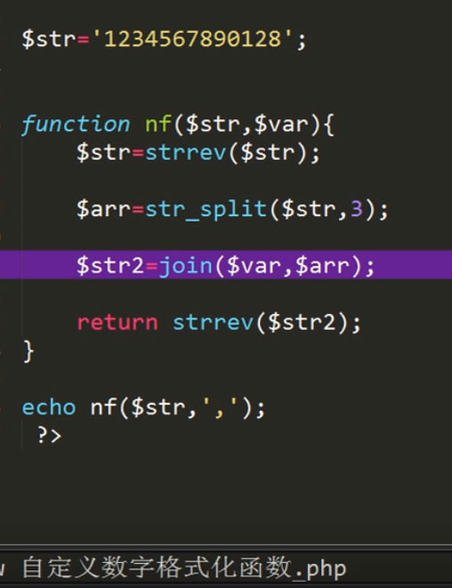
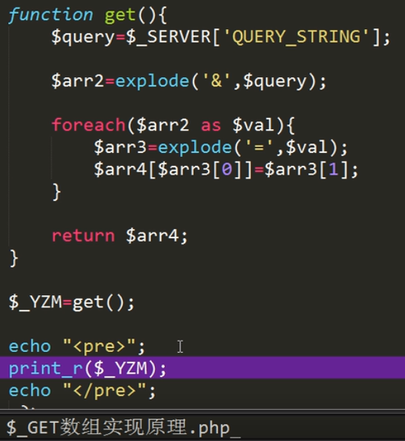

错误处理
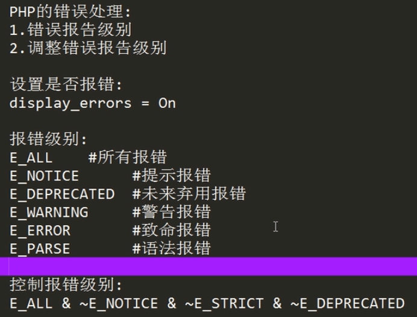
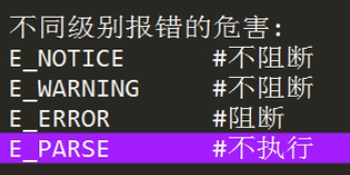

文件操作
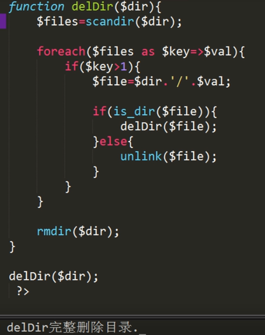
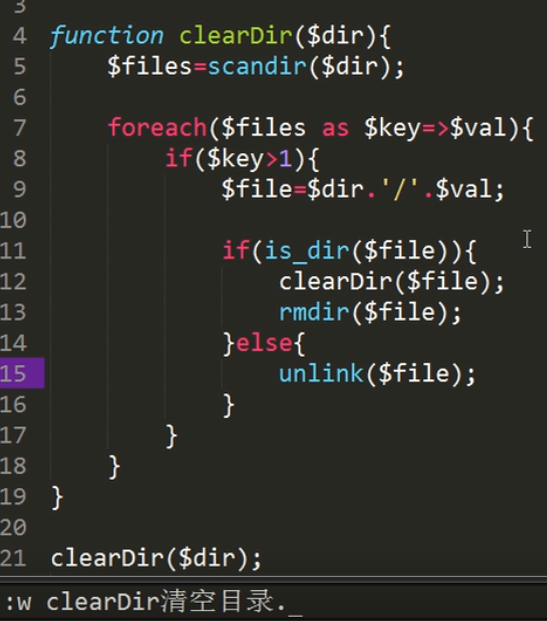
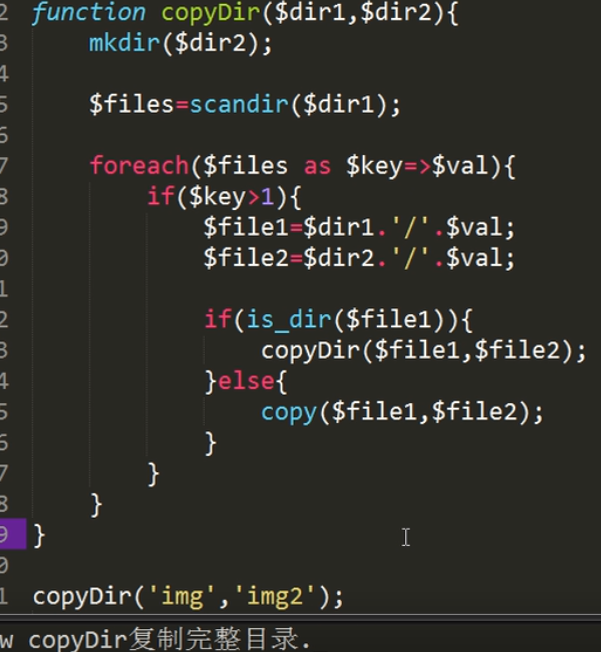
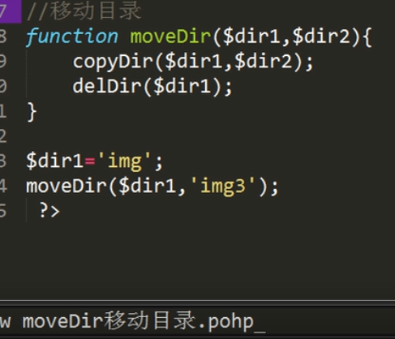

简易版文件上传
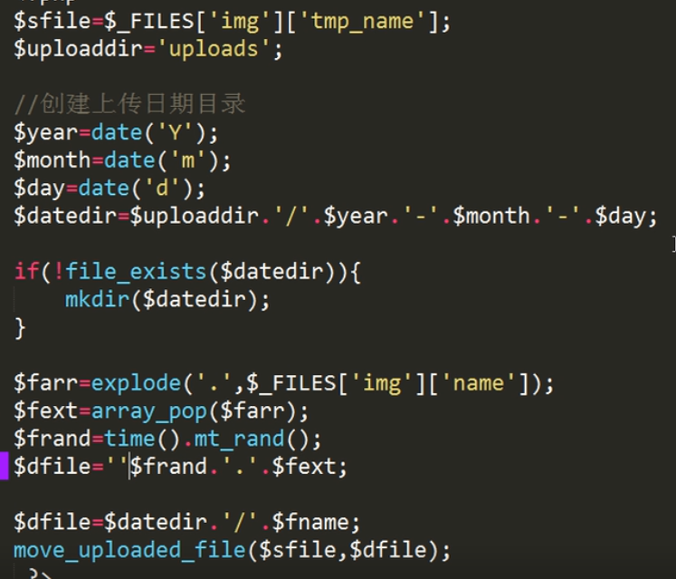
http://www.runoob.com/php/php-file-upload.html

文件下载
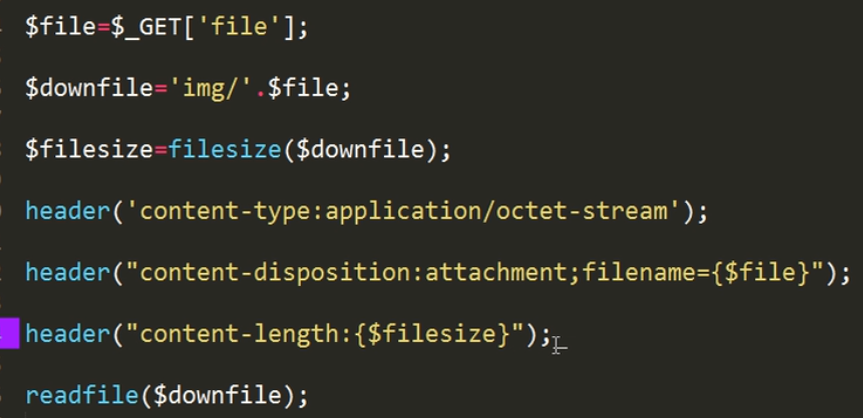
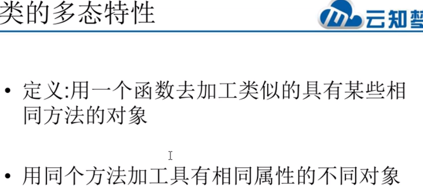
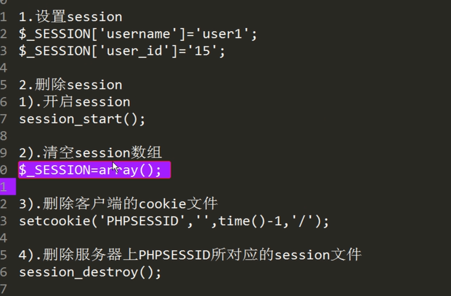


```

* php语法
* phpinfo()php探针
echo "Hello World";
echo '<br/>';
echo 20 +30;
echo '<br/>';

 * 数据类型
 * 字符串、整数、浮点数、逻辑、数组、对象、NULL。
 * 变量：
 * 获取类型结果
 * gettype();
 * 变量赋值：$变量名 = 变量值
 * 删除变量 unset($变量名)
 * 检测变量 isset($变量名) empty($变量名)
 * 精确检测
 * is_int/is_string/is_array/.....
 * 输出字符串，强制转换 echo()
 * 输出内容的长度类型值 var_dump() 布尔
 * 命名规则：
 *  1.严格区分大小写
 *  2.变量名只能以数字字母下划线开头，不能以数字开头
 *  3.尽量语义化 驼峰 下划线分割
 *  4.$this 不能用，系统保留变量
 *  变量赋值方式
 *  1.传值赋值
 *      $a = 10 ;
 *      $b = $a;
 *  2.引用赋值
 *      $a = 10 ;
 *      $b = &$a;
 * 可变变量
 *  将变量的值作为变量的名字使用
 *  $$变量名字 = 变量值
 * $$name = 10
 * 预定义变量
 *  $_GET 接收get方式的传值
 *  $_POST接收post方式的传值
 *  $_REQUEST 所有方式的传值
 *  $_SERVER 服务端信息 浏览器信息
 * 常量
 * 不可改变值的变量
 * 常量名通常大写
 * 常量的值通常为标量类型（简单类型：数字、字符串、布尔）
 * define('常量名','常量值')
 *  检测常量
 *  defined('常量名')
 *  区分大小写
 * 预定义常量
 * 检测是否是函数
 * function_exists('')
$userName = 'chaochao';
$passWord = '123456';
echo $userName;
unset($userName);
echo '<br/>';
var_dump(isset($userName));
echo '<br/>';
$a = 10;
$b = &$a;
$b = 12;
$a = $b;
echo $b;
echo '<br/>';
echo $a;
echo '<br/>';
$str = 'php';
$$str = 'hello';
echo $str;
echo '<br/>';
/**
 * 预定义变量
 * $_GET接收get方式的传值 结果是数组
 * 接收变量
 * $变量名 = $_GET['参数名']
 * implode(‘--’，变量名)将数组元素通过--拼接为字符串输出
 * $_POST接收post方式的传值
 * $_REQUEST 任何方式的传值
 */

//var_dump( $_GET);
//$userName = $_GET['username'];
//$passWord = $_GET['password'];
//echo '<br/>';
//echo $userName;
//echo '<br/>';
//echo $passWord;
//echo '<br/>';
//
//var_dump($_POST);
//echo '<br/>';
//$vcode = $_POST['vcode'];
//$phone = $_POST['phone'];
//$hob = $_POST['hob'];//数组
//echo $vcode .'shoujihao'. $phone;
//var_dump($hob);
//echo implode('/',$hob);
////常量（不可删除或更改）
//define('PI','3.1415');
//echo PI;
echo '<br/>';
/**
 * 数据类型：
 *  1.简单类型：
 *      整数型、小数型、字符串、布尔
 *  2.复合类型
 *      Array、Object
 *  3.特殊类型：
 *      Resource
 *      Null
 * 整数的范围0111 1111 1111 1111 1111 1111 1111 1111
 *PHP_INT_MAX
 * 1个整数在计算机中占有4个字节
 * 字节（byte）是计算机中最小的存储单位
 * 二进制位（bit）是计算机中最小的计算机单位
 * 1byte = 8bit
 * 1kb = 1024byte
 * 1MB = 1024kb
 * 1GB = 1024MB
 * 1TB = 1024GB
 * 整数的表示方式
 * 十进制 50
 * 八进制 050
 * 十六进制 0x50 （0-9a-f）
 * 二进制 0b101011
 *
 * 进制转换
 * 其他进制转十进制（乘法）
 * 十进制转其他进制（除法）
 * 除法取余，倒着读
 * 进制转换函数
 * bin 二进制
 * dec 十进制
 * oct 八进制
 * hex 十六进
 *
 * bindec()
 * decoct()
 * dechex()
 * base_convert(要转换的对象，从哪个进制，转为哪个进制) //在任意进制之间转换
 *
 * 小数型
 *浮点数Float类型不能精确对比，有效位14位，不区分单精度双精度
 *
 * 字符串类型 String
 * 四种表示方式
 * 通常用于定义单行字符串（单引号不能解析变量和转义字符，但是可以解析\'，双引号可以解析、转义），必须成对出现
 * 如果变量名和内容值发生冲突可以使用{}将变量框起来
 * 单引号、双引号
 * 定义多行字符串
 * heredoc 可转义字符变量
 * $str = <<<XXX
 * 内容
 * XXX;
 * Nowdoc 不可转义字符变量
 * $str = <<<'XXX'
 * 内容
 * XXX;
 *
 *
 */
$a = 'zhangsan';
$str = 'abxcd';
$str2 = "{$a} abcde";
echo $str2;
echo '<br/>';
$str3 = <<<XXX
wuyudjslalfjlsafljlajfla;j,$a
XXX;
echo $str3;
echo '<br/>';
$str4 = <<<'XXX'
wuyudjslalfjlsafljlajfla;j,$a
XXX;
echo $str4;
echo '<br/>';
/*
 *
 * 数组类型Array
 * 索引数组（下标）、关联数组（键名）
 * 数组索引默认从0开始
 *
 * 索引数组
 *  以数字作为数组的键名
 * 定义数组
 * $arr = array(数组元素)
 * $arr = array('zhangsan',50,true);
 * 使用数组
 * $数组名[下标]
 *
 *关联数组（键名）
 * 以字符串作为数组的键名
 * 定义数组
 * $arr = array(键名=>键值)
 * 其他方式定义数组
 * $数组名 = [数组名，数组名];
 * */

$arr = array('战三',50,true);
var_dump($arr);
echo $arr[0];
$arr2 = array('name'=>'战三','age'=>50,'flag'=>true);
var_dump($arr2);
echo $arr2['name'];
/**
 * 类型转换
 *  强制转换
 *      (转换类型)值
 * 自动转换
 * 在运行中PHP会自动转换
 *
 */

$a = 10;

$a = (string)$a;
echo '<br/>';
var_dump($a);
/*
 * 运算符
 *
 *  算术运算符
 *  + - * /
 * % 取模
 * ** 幂
 * ++  自增一
 *  谁在前先运算
 * --  自减一
 *
 * 比较运算符
 * >
 * <
 * >=
 * <=
 * !=
 * == 等值
 * === 全等 判断值和类型
 * !== 不等于
 * <> 不等于
 * <=> 结合比较运算符 比较大小
 *      前面大，结果为1
 *      前面小，结果为-1
 *      相等，结果为0
 *
 * 条件运算符
 *  三目运算符  （） ？（） ： （）
 *  空合并运算符 （） ？？ （）
 *      从第一个表达式开始查找找到第一个不为null的值为运算结果，如果全部为null则返回null
 *      通常用于设置默认值
 *      $page = $_GET('page') ?? 1
 *
 * 逻辑运算符
 * 与 &&  真真为真
 * 或 ||  (or 短路运算符) 假假为假
 * 非  ! (取反)
 *
 * 字符串运算符
 *  . 链接字符串
 *
 * 赋值运算符
 * +=
 * .= 拼接
 * -=
 * *=
 * /=
 * %=
 *
 */
$a = 50;
$b = $a++ +1;
echo $b;

/*
 *流程控制语句
 * 流程图
 *  if else
 *       单分支
 *       多分支 最苛刻条件必须放在最上面
 *
 * if(条件判断) {
 *    代码块
 * } else {
 *    代码块
 * } elseif () {
 *
 * } elseif() {
 *
 * }
 *
 * switch case
 *
 * switch (状态值) {
 *      case 状态1：
 *          代码块
 *      break;
 *      case 状态2：
 *          代码块
 *      break;
 *      case 状态3：
 *          代码块
 *      break;
 *      default:
 *          全部满足的代码块
 * }
 *
 * 区别：
 *  switch是状态分支对比，==对比
 *  if可以进行区间判断，范围判断
 *

 *
 * for循环 次数已知
 *
 * for(初始化条件;条件判断表达式；条件改变表达式){
 *      //循环体
 * }
 *
 * for($i = 1;$i<=100;$i++){
 *     echo $i;
 *      echo '<br/>'
 * }
 *
 * while 循环 次数未知，循环条件清楚
 *
 * while(条件判断表达式) {
 *  //循环体
 * }
 *
 *
 * do...while 至少循环一次
 *
 * do {
 *    //循环体
 * } while(条件判断);
 *
 *
 * break 中断循环
 * continue 跳出本次循环，继续下一次循环
 *
 *
 * 替代语法
 * 常用于模板文件中
 * ：代替{
 * end + 关键字 代替 }
 *
 *
 *
 *
 * 文件加载
 * 文件路径必须为相对路径 不能省略./
 * include 报错时，警告，继续执行
 *      include ‘文件路径’
 *      include ('文件路径')
 * require 报错时，致命错误，后面不再执行
 *      require ‘文件路径’
 *      require ('文件路径')
 * require_once
 *
 * include_once 只执行一次
 *
 *
 * 函数
 * function 函数名（）{
 *      代码块
 * }
 *
 * 函数名（）
 * 默认参数、引用参数、回调参数
 *
 * 形参实参 与js中的一致
 *
 * function fn（a,b）{}
 * fn(1,3)
 * 返回值 return
 *
 * 函数实参的获取,只能在函数内部使用
 * func_get_args() 返回一个数组参数列表
 * func_num_args() 返回有多少个参数
 * count() 统计数组中元素的个数
 * 参数的引用赋值，传递是内存地址，是可变的
 *
 * 变量作用域
 *  全局变量：在函数外部定义的变量
 *  局部变量：在函数内部定义的变量
 *  超全局变量：由系统自动定义的，在任意地方随便使用
 *
 * 变量跨作用域访问
 *  1.借助超全局变量$_GET $_POST
 *  2.使用$GLOBALS使用变量 推荐
 *  var_dump($GLOBALS)
 *  3.global关键词
 *      global $str; 修饰为全局变量
 *
 * 静态局部变量
 *  函数内部只会初始化执行一次，函数执行结束后不会销毁，直到PHP脚本执行完毕才会销毁
 *  function （） {
 *      static $变量名 = 变量值;
 * }
 *
 *
 * 递归
 *  在函数内部调用自己
 *  function fn（）{
 *      fn();
 * }
 * fn();
 *
 * 数组
 *
 * 关联数组
 * 索引数组
 * 一维数组
 * 多维数组：数组内还有数组
 *
 * 遍历数组：
 *  1.for循环只能遍历索引数组，下标必须是连续的
 *  2.foreach
 * for($i=0;$i<count($数组名);$i++){
 *      代码块
 * }
 * foreach($数组名 as 赋值键名的变量 => 赋值键值的变量){
 *      代码块
 * }
 *foreach($数组名 as 赋值键值的变量){
 *      代码块
 * }
 *
 * 支持break,continue
 * foreach的值
 * 遍历数组时会将数组元素的键名和键值分别赋值给对应的变量，
 * 变量产生不会影响原数组但使用引用赋值则会改变原数组。
 *foreach遍历的是数组副本，遍历过程中改变数组结构不会影响结果
 *
 * list语法结构
 * 从数组中读取元素依次赋值
 * list(变量1，变量2) = $变量名；
 *
 * 多维数组的遍历与一维数组的遍历方法一样
 *
 * 删除数组 unset($数组名)
 * 检测数组
 * is_array($数组名)检测是否是数组
 *  isset($数组名[键名])检测数组元素是否存在
 * 新增数组元素
 *$数组名[] = 新元素值
 *
 * 数组函数：PHP参考手册
 * array_values()获取数组的值
 * array_keys()获取数组的键
 * in_array(‘变量名’，数组名)检查数组中的值是否存在 常用于检测文件后缀
 * array_filp()数组的键值对调
 * array_key_exist()检查数组的值是否存在
 * array_reverse()数组的键值反转 倒序
 * count() 统计数组中元素的个数
 * array_count_values()统计数组中的值出现的次数
 * array_unique()数组去重
 *
 * 回调参数处理数组函数
 * array_filter($arr,'回调')数组过滤,默认过滤值为假的过滤
 * array_map(‘回调’，$arr) 将回调函数作用在给定数组上
 *
 * 打印数组
 * var_dump()
 * print_r()
 *
 * 字符串转换为数组：explode(' ',$str)
 * 数组转换为字符串:implode(' ',$arr)
 *
 * 变量与数组之间的转换
 * extract()将数组转化为变量，将数组的键名作为变量名，数组的值为变量值
 * compact(var1,var2,var3)用给定的变量创建数组
 * 数组的分段和填充
 * array_splice($arr,0,2)
 *数组的排序
 * 栈和队列
 * sort()从小到大
 * rsort()从大到小
 * asort()到小到大保留键名
 * arsort()从大到小保留键名
 * ksort()按照键名排序（从小到大）自定义
 * krsort()按照键名排序（从大到小）自定义
 * natsort()自然排序，按照人为排序
 * usort()自定义排序，告诉计算排序规则 -1 0 1
 * array_multisort()
 *拆分合并数组
 * array_slice($arr,1,3) 截取一段数组,从那开始截取到少个，不改变原数组
 * array_splice() 截取数组，改变原数组
 * array_combine($arr,$arr1)键值合并
 * array_merge($arr1,$arr2) 数组合并
 * implode(' ',$arr)数组通过某个符号转换为字符串/join()
 * explode(' ',$str)字符串拆分为数组
 * 增删
 * array_pop()从数组最后删除一个值，并返回弹出值
 * array_push()从数组最后插入一个值，并返回新数组长度
 * array_shift()从数组数组最前面弹出一个值，返回弹出值，下标重新排列
 * array_unshift()从数组最前面插入一个值，返回数组个数
 * 其他数组
 * array_rand()随机取出一个key值
 * shuffle()打乱数组
 * array_sum（）数组求和
 * range()获取一个范围内的数组 常用于验证码
 *
 * 字符串
 * . 链接字符串
 * 字符串处理
 * []操作符 索引从0开始，可以查看修改不可删除
 * 多字节字符
 *
 * 字符串函数
 * implode(' ',$arr)数组通过某个符号转换为字符串/join()
 * explode(' ',$str)字符串拆分为数组
 * join()
 * strlen()字符串长度
 * strrev()字符串反转
 * number_format()数字格式化
 * md5()md5加密
 * str_shuffle()打乱字符串
 * ltrim()去除左边的空格
 * rtrim()去除右边的空格
 * trim()去除左右空格
 * str_pad(‘’)在原有字符串上填充
 * str_repeat(‘-’，100)重复
 * strtolower()字符串小写
 * strtoupper()字符串大写
 * ucfirst()首字母大写
 * ucwords()每个单词的首字母大写
 * 与HTML标签相关的函数
 * nl2br() \n转换行
 * htmlspecialchars() HTML转义字符，多用于吧字符串插入到数据库的SQL语句
 * htmlspecialchars_decode() HTML反转义字符
 * strip_tags()去掉HTML代码
 * addslashes()把字符串单双引号转义，多用于吧字符串插入到数据库的SQL语句
 * stripslashes()
 * strpos()从开始位置查找字符位置
 * strrpos()从结束位置查找字符位置
 * 字符串截取函数
 * substr($str,0,3)//从0开始截取3个字符，第三个参数不写就是到最后，负数为从右往左截取
 * mb_**** 多字节字符处理
 *
 * mb_substr($str,4,3,'utf-8')多字节字符截取
 *
 *strrchr()从倒数位置搜索字符，找到后截取 ，通常截取文件中的文件名
 *
 * 替换字符串
 * str_replace()字符串替换
 * str_split()字符串分割为数组
 * 字符串中的路径函数
 * basename()截取路径中的目录部分
 * dirname()截取路径中的文件部分
 * pathinfo()路径信息
 * parse_url($str)解析URL中的参数
 * parse_str($str)
 *
 *正则表达式
 * 原子
 * .匹配所有
 * a-z A-Z 0-9
 * (abc) [0-9]
 * |或者
 * \d任一数字
 * \D任一非数字
 * \w任一字母、数字、下划线
 * \W 除了字母、数字、下划线
 * \s 空格
 * \S非空格
 * [^]取反
 * 元字符
 * *任一个原子
 * +多个原子，包含一个
 * ？任意一个，可有可无
 * |或者
 * ^以什么开始
 * $以什么结尾
 * {3,7}3-7
 * {3}匹配3个
 * {3，,3个以上
 * []
 * (1,2)向后引用，位置变量
 * \\ 向后引用
 * \b词边界
 * \B非词边界
 * 模式修正符
 * i忽略大小写
 * U贪婪模式
 * m把\n视为多个
 *
 * 检测手机格式是否正确
 * preg_match('/^\d{11}$/',$str) 匹配当前
 * preg_match_all('/^\d{11}$/',$str)匹配所有
 * preg_replace(‘’，$str) 替换
 * preg_grep('',$str) 包含，过滤
 * preg_split(‘’，$str)分割
 * 检测手机格式是否以139开头
 * /^139\d{8}$/
 *检查邮箱格式
 * /^\w+@\w+\.\w+$/
 *复杂的字符串替换场景
 * preg_replace('','',$str)
 *
 * 数学函数
 * max()最大
 * min()最小
 * round() 四舍五入
 * ceil() 向上取整
 * floor() 向下取整
 * mt_round() 随机
 *
 * 日期函数
 * usleep()暂停时间 微秒
 * sleep()暂停时间 毫秒
 * time()时间戳
 * strtotime() 日期字符串转为时间戳
 * date(‘Y-m-d H:i:s’,0) 时间戳转为几月几号
 * microtime(true)微秒
 *
 * 格式化参数
 * y\m\d h i s
 * n 1-12月
 * d 01-31
 * j 1-31
 * H 24小时
 * w week 周
 * A a 上午下午
 * L平年闰年
 * t 一月多少天
 *
 * php错误处理
 * 错误级别
 * 调整级别php.ini
 * display_errors = off
 *
 * 图片处理
 * 使用方法查手册
 * 图片验证码
 * 使用session时
 * session_start()前置，而且前面不能有任何输出
 * $_SESSION[]
 *
 *文件处理
 * filetype()判断文件或者目录
 * is_dir()判断是否为目录
 * is_file()判断是否为文件
 * file_exists()判断文件是否存在
 * filesize()判断文件大小
 *
 *文件操作
 * unlink() 文件删除
 * copy() 文件复制
 * rename（）重命名
 * fopen()打开文件
 * fclose()关闭文件
 * 读取文件
 * fread()
 * readefile() 读取文件直接输出
 * file_get_contents() 读取文件内容
 * $url = 'www.baidu.com'
 * file_get_contents($url)页面静态化
 * 写入文件
 * fwrite()
 * file_put_contents($file,'neirong')写入内容
 * file_put_contents($file,'neirong',FILE_APPEND) 追加写入内容
 *
 * 目录操作
 *
 * 遍历目录
 * opendir()
 * readdir()
 * closedir()
 * scandir()
 *
 * 创建目录
 * mkdir()
 *
 * 删除目录
 * rmdir()
 *
 * 删除完整目录delDir
 * scandir
 *
 * 复制目录
 * cpDir
 *
 * 移动目录
 * 复制目录
 * 删除原目录
 * mvDir
 *
 *文件上传
 *move_uploaded_file($sfile,$dfile)
 *
 *文件下载
 *move_uploaded_file($sfile,$dfile)
 *
 * PHP算法
 * 排序算法
 * 冒泡排序
 * 快速排序
 *
 *面向对象
 *封装、继承、多态
 *
 *php中的面向对象
 * Person 类定义
 * 文件名与类名要一致
 * 类名每个单词首字母必须大写
 * $this指向当前对象
 * SELF 指向本类
 * 构造方法
 *  __construct
 * 析构方法
 * __destruct
 * 析构时对象从下往上析构  123-》321
 * 对象链
 * 实现原理：中间的方法返回自己的对象 return $this;
 * $obj->show()->say()->.....
 *
 * 封装特性
 * 对象修饰词
 * public 对象    -----公开 子类和外面的都可使用
 * private 对象   -----隐私 子类可以使用，外面的不能使用
 * protected 对象 -----被保护的 子类和外面的都不可使用
 * 属性作用域
 * 属性作用域
 * 局部变量的作用域
 *
 * 继承特性
 *关键字 extends parent::
 *父类
 *子类
 *class IT extends Person
 * parent::     ====继承父类
 *
 * 抽象类
 * 关键词 abstract  extends
 * 例子：
 * abstract class Father{
 *   abstract function stop();
 * }
 * class Son extends Father{
 *  function stop () {
 *      //实现父类方法
 *  }
 * }
 * 含有抽象方法的类
 * 抽象方法
 *  abstract function show()
 * 没有方法体的方法
 *
 * abstract class Person{
 *      function show()
 * }
 *
 * 接口
 * 关键字 interface implements
 * 例子：
 * interface Usb{
    function start();
    function run();
    function end();
   }

    class Upan implements Usb{
        function start()
        {

        }

        function run()
        {

        }

        function end()
        {

        }
    }
 *
 *
 * 多态
 * 介入区分
 *函数可以根据类的父类或者祖先的不同而表现出不同的形态或者结果
 * 相同的函数或方法可作用于多种类型的对象上并获得不同的结果
 *
 *魔术方法
 * __construct  调用构造方法
 * __destruct   调用析构方法
 * __toString   给类增加一个说明
 * __call   调用类中不存在的方法时
 * __get    访问类中无权访问的成员时候调用
 * __set    设置类中无权设置的成员时候调用
 * __isset 查看类中无权查看的变量成员
 * __unset查看类中无权删除的变量成员
 *
 *关键字
 *类常量const 可以修饰属性
 * 最终版本final 可以修饰类和方法
 * 静态成员static 可以修饰属性和方法
 *
 *
 */

$list = ['list1'=>'12','list2'=>'13'];
$list2 = ['list1','12','list2','13'];
for ($i=0;$i<count($list2);$i++) {
    echo $list2[$i];
}
foreach($list as $key => $value){
    echo $value;
}
foreach($list as $value){
    echo $value;
}

echo '<br>';

//面向对象

//类定义
class Person {
//属性
    public $name = 'user1';
    public $age = 20;
    public $sex = 'nan';
//构造方法
    function __construct($n,$s,$a){
        $this->name = $n;
        $this->age = $s;
        $this->sex = $a;
    }
//析构方法
    function __destruct()
    {
        // TODO: Implement __destruct() method.
        echo $this->name;
    }
    //方法
    function say (){
        echo 'hello world';
        echo '<br>';
        echo $this->name;
        echo $this->age;
        echo $this->sex;
        return $this;
    }
    function eat(){
        echo 'eat';
        return $this;
    }
    function sleep(){
        echo 'sleep';
        return $this;
    }
}

//
//实例化
$user1 = new Person('user123','20','nv');
//类调用
$user1 -> say();
echo '<br>';
echo $user1->name.'<br>';
echo $user1->age.'<br>';
echo $user1->sex.'<br>';
//对象链实现原理
$user1->say()->eat()->sleep();
//通过类直接调用方法，但是类只能去调用没有$this的方法
//Person::say('hello');

//类继承
class IT extends Person {
    public $program;

    function __construct($n,$s,$a,$p){
       parent::__construct($n,$s,$a);
       $this->program = $p;
    }

    public function develop() {
        echo $this->program;
    }
}

$obj = new IT('hehe',20,'nvnv','php');

$obj ->say();
$obj ->develop();

//接口实现原理
interface Usb{
    function start();
    function run();
    function end();
}

class Upan implements Usb{
    function start()
    {
        // TODO: Implement start() method.
    }

    function run()
    {
        // TODO: Implement run() method.
    }

    function end()
    {
        // TODO: Implement end() method.
    }
}
echo PHP_EOL;
?>


php接口编写总结
1.先配置路由Route.php
2.对应控制器下的方法
3.公共配置文件控制器的方法

```