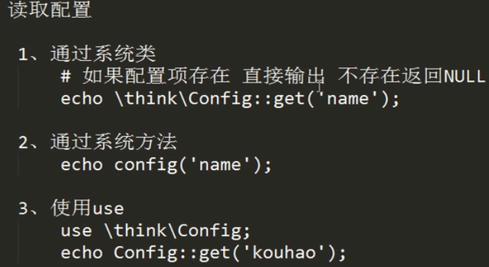
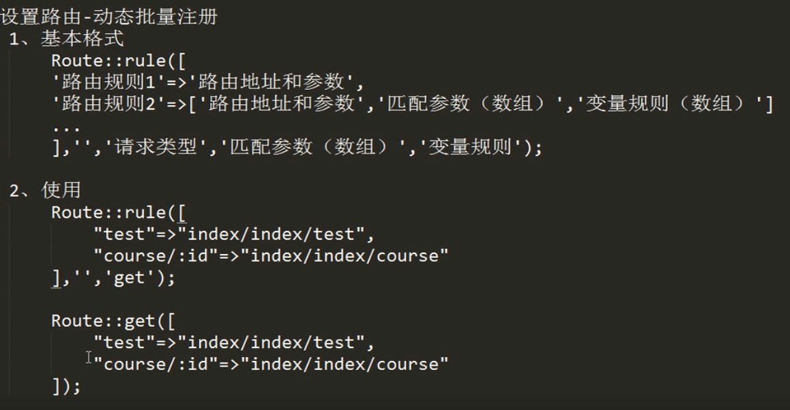
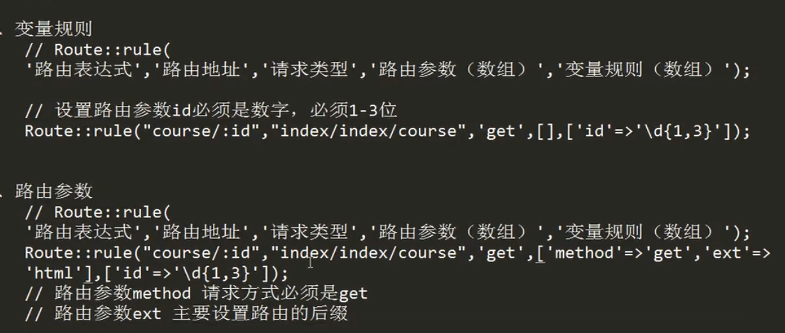
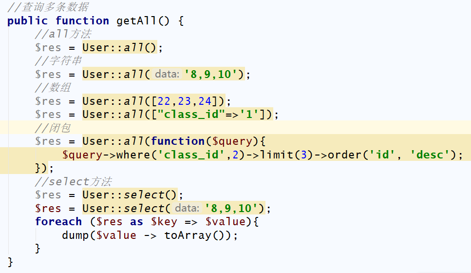
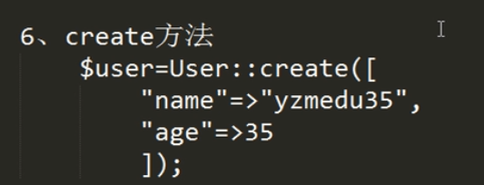
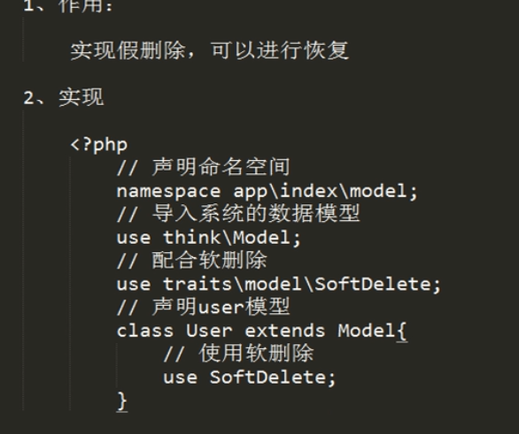
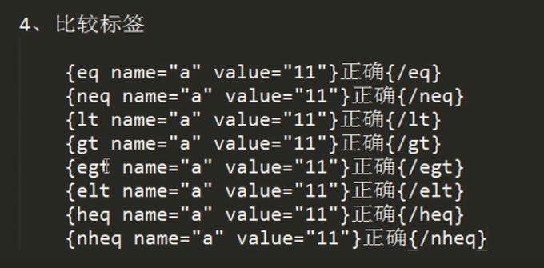
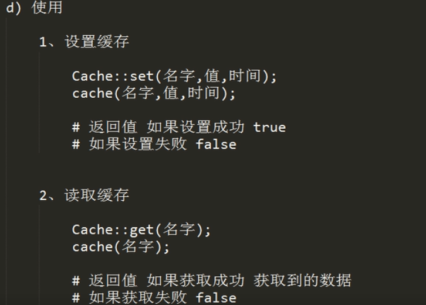

# ThinkPHP5.0学习笔记
```
安装虚拟机：PHPStudy
PHPStudy  Apache无法启动解决办法：环境端口检测强制关闭被占用端口
ThinkPHP5.0学习官网：https://www.kancloud.cn/manual/thinkphp5/118006
```
### 一、安装方法
1.直接安装

2.Git安装
首先克隆下载应用项目仓库
git clone https://github.com/top-think/think tp5

然后切换到tp5目录下面，再克隆核心框架仓库：
git clone https://github.com/top-think/framework thinkphp

### 二、配置虚拟主机
1）. 配置本地路由表（C:\Windows\System32\drivers\etc\hosts）
127.0.0.1 	www.tp.com
2）.phpstudy站点域名管理
1.phpstudy打开apache配置文件httpd.conf
第514行打开注释
Include conf/extra/httpd-vhosts.conf
2.修改虚拟主机及配置
phpstudy  vhosts.ini

登录PHPMyAdmin或localhost报404
1.查看端口号是否被占用 cmd netstat -ano 
2.如果80端口被占用，修改端口号
httpd.conf下设置Listen 8080
vhosts.ini下设置

https://www.jianshu.com/p/20b3dcd6187c
https://www.cnblogs.com/xuebi/p/6244089.html

### 三、目录结构

地址解析
http://serverName/index.php（或者其它应用入口文件）/模块/控制器/操作/参数/值…

### 四、tp开发流程
0.开启调试模式
D:\WorkBag\phpStudy\PHPTutorial\WWW\tp5\application\config.php
// 应用调试模式
'app_debug'              => true,
1.链接数据库
D:\WorkBag\phpStudy\PHPTutorial\WWW\tp5\application\database.php
打开文件修改数据库名、用户名、密码
// 数据库类型
    'type'            => 'mysql',
    // 服务器地址
    'hostname'        => '127.0.0.1',
    // 数据库名
    'database'        => 'test',
    // 用户名
    'username'        => 'root',
    // 密码
    'password'        => '123',
2.书写代码
D:\WorkBag\phpStudy\PHPTutorial\WWW\tp5\application\index\controller\Index.php

3.页面

MVC模式详解


### 五、ThinkPHP5.0的应用请求的生命周期,整个执行流程
1.入口文件www/tp5/public/index.php
2.框架引导文件
start.php引导文件首先会调用base.php基础引导文件
加载系统常量定义；
加载环境变量定义文件；
注册自动加载机制；
注册错误和异常处理机制；
加载惯例配置文件；
执行应用；
3、注册自动加载Loader::register()
4、注册错误和异常机制Error::register()
5、应用初始化run

### 六、thinkPHP配置  以数组为主
//项目配置文件
return [
    // 默认模块名
    'default_module'        => 'index',
    // 默认控制器名
    'default_controller'    => 'Index',
    // 默认操作名
    'default_action'        => 'index',
    //更多配置参数
    //...
];
在ThinkPHP中，一般来说应用的配置文件是自动加载的，加载的顺序是：
惯例配置->应用配置->扩展配置->场景配置->模块配置->动态配置
惯例配置---->tp5/thinkphp/convention.php
应用配置应用配置文件是应用初始化的时候首先加载的公共配置文件，默认位于application/config.php
扩展配置扩展配置文件是由extra_config_list配置参数定义的额外的配置文件，默认会加载database和validate两个扩展配置文件。



### 七、thinkPHP路由

隐藏入口文件
在ThinkPHP5.0中，出于优化的URL访问原则，还支持通过URL重写隐藏入口文件，下面以Apache为例说明隐藏应用入口文件index.php的设置。
下面是Apache的配置过程，可以参考下：
1、httpd.conf配置文件中加载了mod_rewrite.so模块
2、AllowOverride None 将None改为 All
3、在应用入口文件同级目录添加.htaccess文件，内容如下：
<IfModule mod_rewrite.c>
Options +FollowSymlinks -Multiviews
RewriteEngine on
RewriteCond %{REQUEST_FILENAME} !-d
RewriteCond %{REQUEST_FILENAME} !-f
RewriteRule ^(.*)$ index.php/$1 [QSA,PT,L]
</IfModule>
更多其它环境的隐藏入口文件参考后面的 URL重写
设置路由、开启路由

路由的形式


请求类型


动态批量注册路由





URL生成
URL生成使用 \think\Url::build() 方法或者使用系统提供的助手函数url()，参数一致：
Url::build('地址表达式',['参数'],['URL后缀'],['域名'])
url('地址表达式',['参数'],['URL后缀'],['域名'])


新建控制器


我们可以改变默认的模板：
//默认错误跳转对应的模板文件
'dispatch_error_tmpl' => APP_PATH . 'tpl/dispatch_jump.tpl',
//默认成功跳转对应的模板文件
'dispatch_success_tmpl' => APP_PATH . 'tpl/dispatch_jump.tpl',

也可以使用项目内部的模板文件
//默认错误跳转对应的模板文件
'dispatch_error_tmpl' => 'public/error',
//默认成功跳转对应的模板文件
'dispatch_success_tmpl' => 'public/success',


2.空控制器


变量过滤
框架默认没有设置任何过滤规则，你可以是配置文件中设置全局的过滤规则：
// 默认全局过滤方法 用逗号分隔多个
'default_filter'         => 'htmlspecialchars',

也支持使用Request对象进行全局变量的获取过滤，过滤方式包括函数、方法过滤，以及PHP内置的Types of filters，我们可以设置全局变量过滤方法，例如：
Request::instance()->filter('htmlspecialchars');

支持设置多个过滤方法，例如：
Request::instance()->filter(['strip_tags','htmlspecialchars']),

也可以在获取变量的时候添加过滤方法，例如：
Request::instance()->get('name','','htmlspecialchars'); // 获取get变量 并用htmlspecialchars函数过滤
Request::instance()->param('username','','strip_tags'); // 获取param变量 并用strip_tags函数过滤
Request::instance()->post('name','','org\Filter::safeHtml'); // 获取post变量 并用org\Filter类的safeHtml方法过滤


如果需要更改请求变量的值，可以通过下面的方式：
// 更改GET变量
Request::instance()->get(['id'=>10]);
// 更改POST变量
Request::instance()->post(['name'=>'thinkphp']);


============================================================================================
数据库操作
1.链接数据库databse.php
// 数据库类型
'type'            => 'mysql',
// 服务器地址
'hostname'        => '127.0.0.1',
// 数据库名
'database'        => 'test',
// 用户名
'username'        => 'root',
// 密码
'password'        => '123',
// 端口
'hostport'        => '3306',
2.数据库操作
查：
//导入系统类
use think\Db;
class DataBase
{
    //使用配置文件链接数据库
    public function data(){
        $DB = new Db();
        //查询user表数据
//        $data = $DB::table('user')->select();
        $data = DB::query('select * from user');
        dump($data);
    }
}
助手函数
系统提供了一个db助手函数，可以更方便的查询：
db('user')->where('id',1)->find();
db('user')->where('status',1)->select();

注意：使用db助手函数默认每次都会重新连接数据库，而使用Db::name或者Db::table方法的话都是单例的。db函数如果需要采用相同的链接，可以传入第三个参数，例如：
db('user',[],false)->where('id',1)->find();
db('user',[],false)->where('status',1)->select();

上面的方式会使用同一个数据库连接，第二个参数为数据库的连接参数，留空表示采用数据库配置文件的配置。
增：
//增加数据
public function insert() {
    //第一种方法
  $data = ['username' => 'bar', 'password' => '123','class_id' => '1'];
    Db::table('user')->insert($data);
    $userId = Db::name('user')->getLastInsID();
    //第二种方法
    $data = DB::execute("insert into user value(null,'bar1','123','0') ");
    $data = DB::execute("insert into user value(null,?,?,?)",['bar2','123','0']);
    $data = DB::execute("insert into user value(null,:username,:password,:class_id)",['bar3','123','1']);
    dump($data);
}
助手函数
// 添加单条数据
db('user')->insert($data);
// 添加多条数据
db('user')->insertAll($list);
删除：
//删除数据
public function  delete(){
    //第一种方法
    $data = Db::execute('delete from user where id = 21');
    $data = Db::execute('delete from user where id >?',[25]);
    $data = Db::execute('delete from user where id >:id',[25]);
    dump($data);
}
删除数据表中的数据
// 根据主键删除
Db::table('think_user')->delete(1);
Db::table('think_user')->delete([1,2,3]);

// 条件删除    
Db::table('think_user')->where('id',1)->delete();
Db::table('think_user')->where('id','<',10)->delete();

delete 方法返回影响数据的条数，没有删除返回 0
助手函数
// 根据主键删除
db('user')->delete(1);
// 条件删除    
db('user')->where('id',1)->delete();

更改：
public function update() {
    $data = Db::execute("update user set username = 'user11' where id = 5");
    dump($data);
}
更新数据表中的数据
Db::table('think_user')->where('id', 1)->update(['name' => 'thinkphp']);

如果数据中包含主键，可以直接使用：
Db::table('think_user')->update(['name' => 'thinkphp','id'=>1]);

update 方法返回影响数据的条数，没修改任何数据返回 0
如果要更新的数据需要使用SQL函数或者其它字段，可以使用下面的方式：
Db::table('think_user')
    ->where('id', 1)
    ->update([
        'login_time'  => ['exp','now()'],
        'login_times' => ['exp','login_times+1'],
    ]);
助手函数
// 更新数据表中的数据
db('user')->where('id',1)->update(['name' => 'thinkphp']);
// 更新某个字段的值
db('user')->where('id',1)->setField('name','thinkphp');
// 自增 score 字段
db('user')->where('id', 1)->setInc('score');
// 自减 score 字段
db('user')->where('id', 1)->setDec('score');


数据模型








获取器


修改器


13、软删除



### 八、页面视图相关（View）


### 九、模板相关








