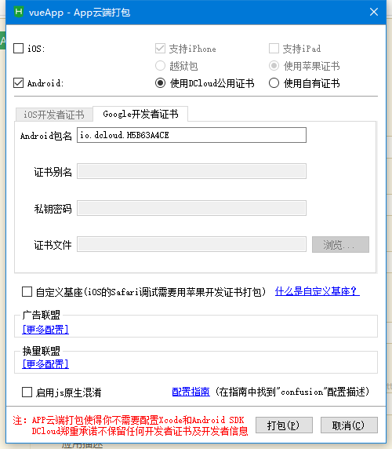

# 使用Vuecli3.0脚手架搭建项目打包APP具体流程
## 使用Vuecli3.0脚手架搭建项目打包APP可以结合Hbuilder开发工具进行APP打包
### 1.首先使用vue命令进行项目的打包执行 num run build ，打包完成之后生成dist文件夹
```
之后的具体操作步骤不再赘述。可参考：https://blog.csdn.net/zhoudan232/article/details/73466814

```
### 2.把dist文件夹中的内容拖到Hbuilder APP项目中（没有APP项目的新建即可）
### 3.点击发行菜单，原生APP云打包，弹出菜单，点击打包即可


### 4.可能遇到问题

```
原因是因为没有修改manifest.json文件中的内容
基本配置必填，剩下的配置根据自己实际开发需要进行配置
```


### 5.必须要说的一点，vue项目自动打包生成的manifest.json文件不可用，必须按要求修改，我的源码如下

```
PS：APP打包手段有很多，也可采用Android Studio 打包，iOS的直接采用Xcode打包即可。
Uni-app框架开发的APP也还可以，跟小程序的操作体验没什么两样。
```