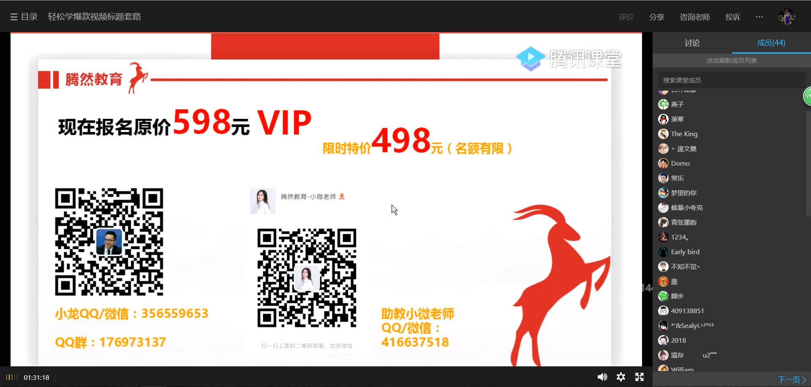
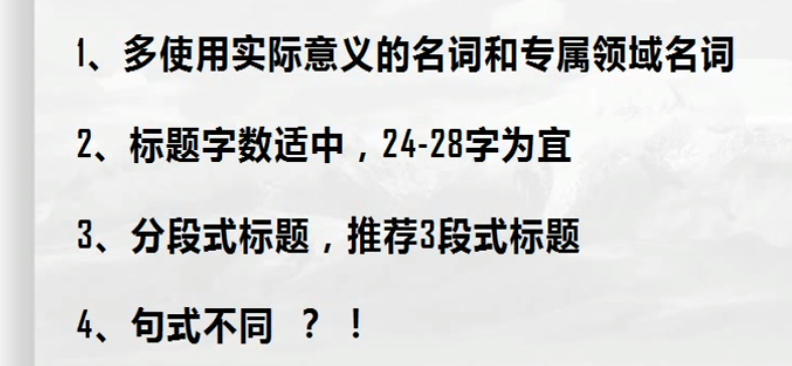
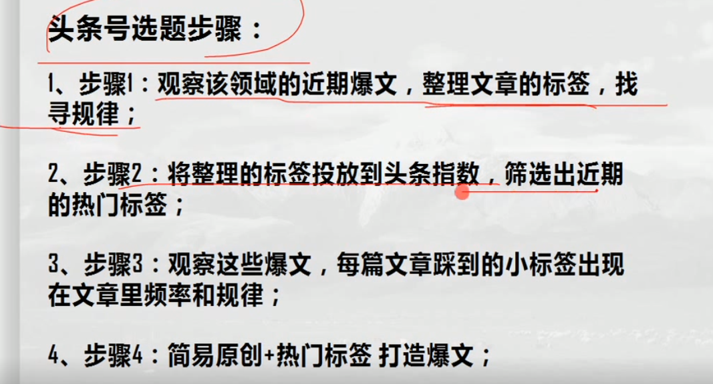
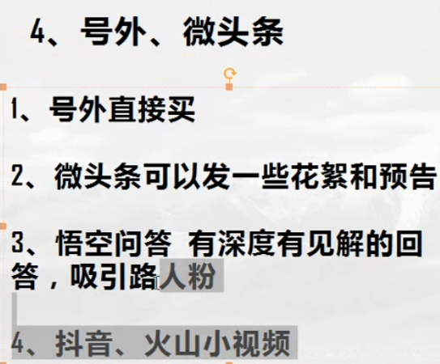

# 自媒体运营方案
### 自媒体常用工具
```
1.配音软件：朗读女
2.视频转换软件：格式工厂 
3.视频素材库：the stocks
4.视频剪辑工具：快剪辑、爱剪辑、会声会影、万兴神剪手
5.字幕工具：快影APP、卡拉OK字幕精灵
6.手机传输工具：爱莫助手
7.录屏工具：ev录屏
8.语音转文字字幕：听写记事本Chrome插件
9.下载视频工具：fvd、idm破解版
10.音频降噪：Adobe Audition
11.变声软件：万能变声器
12.视频剪切合并器
13.视频剪辑：万兴神剪手、Pr
14.视频压缩神器：小丸工具箱
15.图片处理工具：PS
16.多平台助手：微小宝多平台助手
17.爆文工具：微90、易撰、淘金阁
18.有意思的网站：微头条、趣闻猎奇、前十网 
19.视频素材网站：V电影
```
### 爆文4要素
```
爆文4要素：标题、标签、封面、【选题】
娱乐、生活、情感、美妆、游戏、旅游、影视、三农、搞笑
```

### 标题：
```
1.分段式标题、
2.句式多样化
3.标点
4.字数25-30
5.多使用专属领域的名词
```

### 选题角度：



### 涨粉套路


